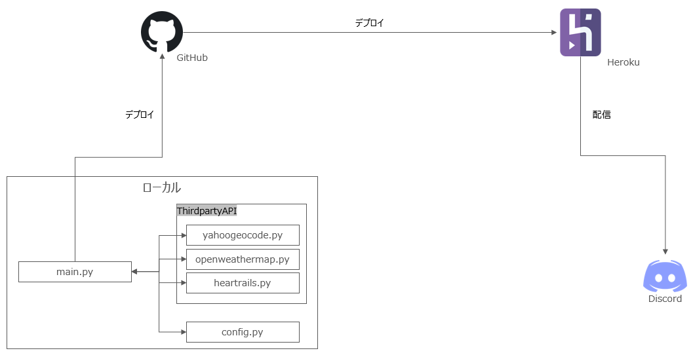

# Discord Weather Bot


<br>


To read in English, please refer [README_EN.md](./README_EN.md).

Discord Weather Botのインベントリページです。なお、このDiscord Weather Botは日本の都市のみ参照可能です。<br>
海外の都市も併せて利用される場合は[Discord Weather Bot Global](https://github.com/Hipro-Official/Discord-Weather-Bot-Global)をご利用ください。<br>

## 仕様

Discord Weather BotはHerokuを使用しています。構成は以下の通りです。


### 機能
Discord Weather Botには以下の機能があります。
1. 特定都市の当日の天気をEmbedで表示
2. 特定都市の翌日の天気をEmbedで表示
3. 特定都市の1週間の天気をEmbedで表示
4. 毎日午前6時に当日の天気をEmbedで配信
5. 毎日午後6時に翌日の天気をEmbedで配信

### 使用方法（コード）
Config/config.pyにAPIのURLやHerokuに登録した環境変数の環境変数名を記載しています。<br>
APIのURLが変更になった場合、異なる環境変数名を使用する場合はこちらのファイルを編集ください。<br>
Herokuの環境変数登録方法は[こちら](https://devcenter.heroku.com/articles/config-vars#using-the-heroku-dashboard)を参照ください。<br>
また、毎日午前6時、午後6時に配信している天気予報の都市は[citylist.json](./JSON/citylist.json)で管理しています。配信する都市数を増やす際はJSON内の配列記法に従い、記載ください。また、都市名は使用方法（コマンド）内の都市名を参照に記載ください。

### 使用方法（コマンド）
1. 特定都市の当日の天気を見る
    ```sh
    $day XXXX
    ```
2. 特定都市の翌日の天気を見る
    ```sh
    $tmr XXXX
    ```
3. 特定都市の1週間の天気を見る
    ```sh
    $week XXXX
    ```
XXXXには都市名を入力ください。なお、都市名には以下の内容が使用できます。
|#|項目|例|
|:-:|:-|:-|
|1|都道府県レベル|東京都|
|2|市区町村レベル|東京都港区|
|3|町・大字名レベル|東京都港区六本木|
|4|丁目・字レベル|東京都港区六本木1丁目|
<br>
コード内では丁目・字レベルで設定されておりますが、それ以上の都道府県レベルや市区町村レベル、町・大字名レベルでも検索可能です。

### 使用API
|#|API名|URL|
|:-:|:-|:-|
|1|Yahoo!ジオコーダAPI|https://developer.yahoo.co.jp/webapi/map/openlocalplatform/v1/geocoder.html|
|2|OpenWeatherMap API|https://openweathermap.org/api|
|3|HeartRails Geo API|https://geoapi.heartrails.com/api.html|

APIを使用するにあたり、各API提供元の制約を遵守ください。<br>

### 注意事項
本Botのコードを全て、または一部修正して使用する場合、以下の内容をライセンスとして挿入ください。
```
Code provided by Hipro
https://github.com/Hipro-Official
```

また、本Botの[config.py](Config/config.py)、[citylist.json](./JSON/citylist.json)を除くファイルのコードを変更して不具合等が発生した場合、Hiproでは責任を一切負いかねますので予めご了承下さい。<br>
不具合等ございましたら、Issueに起票いただけますと幸いです。

### License
GNU GENERAL PUBLIC LICENSE v3.0